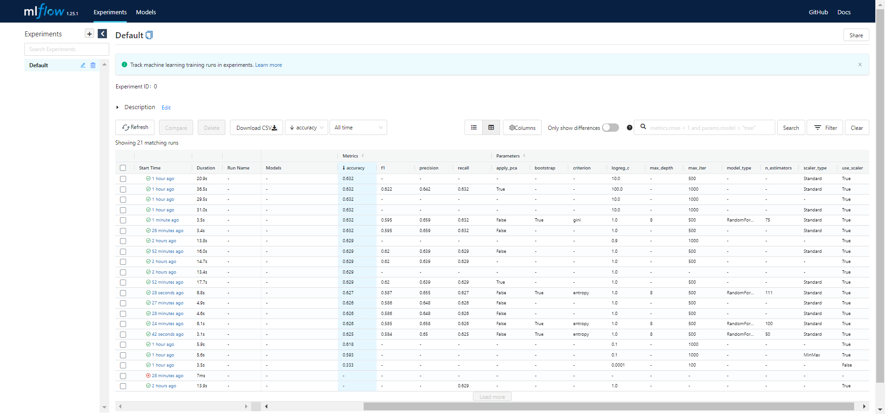

Capstone Project for RS School Machine Learning course.

This project uses Forest Dataset.

Usage

This package allows you to train model for detecting the presence of heart disease in the patient.

1. Clone this repository to your machine.
2. Download Forest dataset, save csv locally (default path is data/train.csv in repository's root).
3. Make sure Python 3.9 and Poetry are installed on your machine.
4. Install the project dependencies (run this and following commands in a terminal, from the root of a cloned repository): poetry install --no-dev
5. Run train with the following command: poetry run train -d <path to csv with data> -s <path to save trained model>
6. You can configure additional options (such as hyper parameters) in the CLI. To get a full list of them, use help: poetry run train --help

7. Run MLflow UI to see the information about experiments you conducted: poetry run mlflow ui

Development

The code in this repository must be tested, formatted with black, and pass mypy typechecking before being commited to the repository.

Install all requirements (including dev requirements) to poetry environment: poetry install

Now you can use developer instruments, e.g. pytest: poetry run pytest

More conveniently, to run all sessions of testing and formatting in a single command, install and use nox: nox [-r]

Format your code with black by using either nox or poetry: nox -[r]s black | poetry run black src tests noxfile.py

Links:
Forest Dataset: https://www.kaggle.com/competitions/forest-cover-type-prediction/data

Poetry Documentation: https://python-poetry.org/docs/

Results of Experiments:

